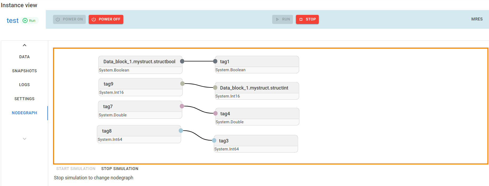

# Changelog

All notable changes to this project will be documented in this file.

The format is based on [Keep a Changelog](https://keepachangelog.com/en/1.0.0/),
and this project adheres to [Semantic Versioning](https://semver.org/spec/v2.0.0.html).

## [Unreleased]

## [0.1.6] - 2025-08-17
Minor update

### Features
- Save nodegraph as json in persistence.json
- Network settings of instance now settable for auto-startup

## [0.1.5] - 2024-12-15
Stabilizing the features of the last version

### Fixes
- Some UI fixes that came in the last versions with the UI changes
- Some routing issues that came with the new routing

## [0.1.4] - 2024-12-12
### Changes
- added menu with routing for the instance view

### Fix
- new attempt for auto tag versioning

## [0.1.3] - 2024-12-10
This update adds a **NODEGRAPH** functionality to the instance view (Simit-alike). This is a very first beta version for the early adopters. Linking outputs to inputs and datablock values is possible.

### Features
- One big feature: nodegraph!

### Fix
- Version in code now automatically updates when building the app

## [0.1.2] - 2024-10-10
Minor update, mainly annoying bugfix and some small performance improvements

### Changes
- In instance view, the buttons (Power On, Power Off, Run, Stop) are now more expressive

### Fix
- Fix the bug of not seeing every instance in the overview when having instances on autostartup

## [0.1.1] - 2024-08-02

### Features
- Add a settings tab in the instance view. It is now possible to enable "Register On Startup" and "Power On Startup". When this is enabled the instance will be registered or started when the manager exe is started.
- Add a persistence.json file in the manager folder to store the settings. 

## [0.1.0] - 2024-07-25

This is a major update with some new features and improvements, mainly for the UI.
The single page approach was getting too cluttered.
The UI now has a navigation panel and dedicate pages for every instance and the settings.

### Changes

- Add controler name to overview table
- IP settings dialog now has tabs for every interface
- BREAKING: snapshots are now stored in the folder `/Manager/Snapshots` instead of `/Snapshots`. If you have created snapshots in the previous version, you can manually create the folder and move them.

### Features

- Logs (e.g. start/stop/ new download) of instances are collected and shown in the UI
- Navigation menu
- Dedicated page for each instance (click on the instance or open the navigation panel on the left to get there)
- Dedicated page for settings
- When multiadapter is selected, you can select specific network interfaces for each adapter in the network settings of the instance now
- some more smaller features

### Fix

- Data view more stable now

## [0.0.6] - 2024-05-08

This version is mainly a UI cleanup and small bugfix

### Changes

- UI improvement for network settings. This is now a table with interfaces and their settings.
- UI improvement for the storage dialog
- Add timestamp to snapshots overview and order by timestamp

### Fix

- Fix bug when snapshot folder does not exit yet
- Fix storage rename button
- Delete snapshots folder when instance storage is cleaned up

## [0.0.5] - 2024-05-01

### Features

- Add basic options for snapshots (Create/Delete/Rename)

### Changes

- Set colors to network buttons
- Change network option to chips

## [0.0.4] - 2024-04-27

### Changes

- Add icons to status

### Features

- Add basic options for storage (Rename/Delete/Duplicate/Register)

## [0.0.3] - 2024-04-25

### Fix

- Improve speed of Network config dialog
- No longer crashes on creating new instance when default path does not exist yet
- No longer crashes when trying to create more instances than PLCsim Advanced max allows

### Changes

- Use Chips for instance status
- Increase update frequency of dataview

### Features

- Add instance status to dataview page
- Network mode now settable via network settings
- Switch binding settable in network settings

## [0.0.2] - 2024-04-14

### Features

- Button to check for updates
- Status of PLC in overview
- Interface mapping: every interface can be mapped to a network interface

### Fix

- Fixed the bug when an instance name was given of an instance that already exits

### Changes

- Moved notifications to bottom right

## [0.0.1] - 2024-01-08

### Added

- Manage plc's from a single page
- Monitor and manipulate variables from the PLC
