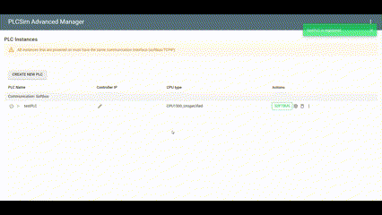
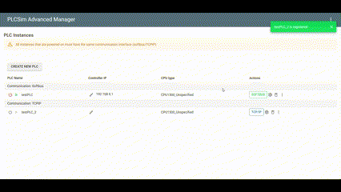

# PLCsim-Advanced-Manager

A webserver manager for Siemens Simatic PLCsim Advanced.
Goals:

- Manage your PLCSIM Advanced instances in a webserver. This way you don't have to login to the target PC, but can start
  instances over the network
- Exploit the functionalities of the PLCSIM Advanced API to create a more user friendly interface.

## Create an instance

## Start an instance

## 

