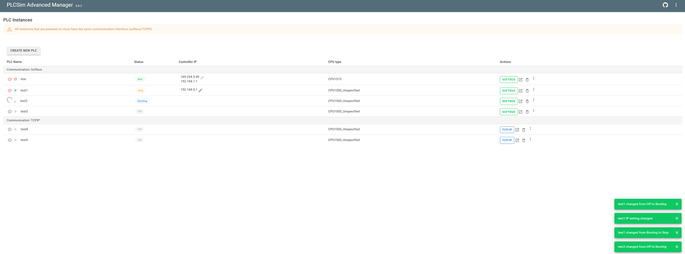
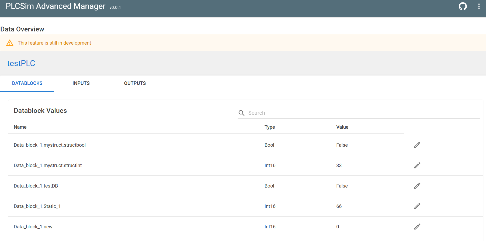
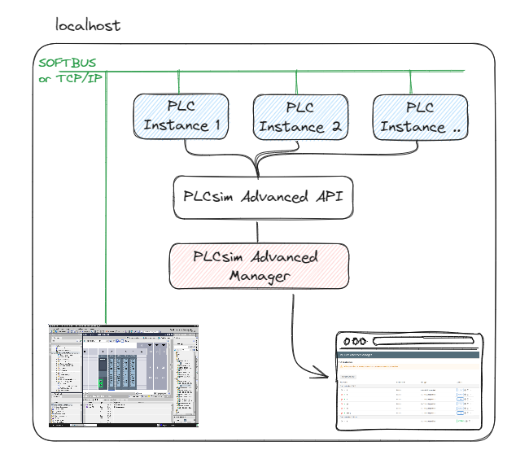
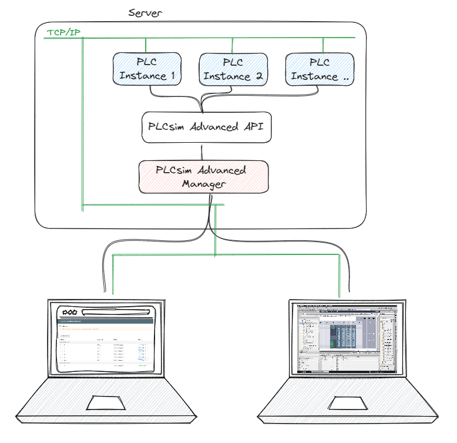
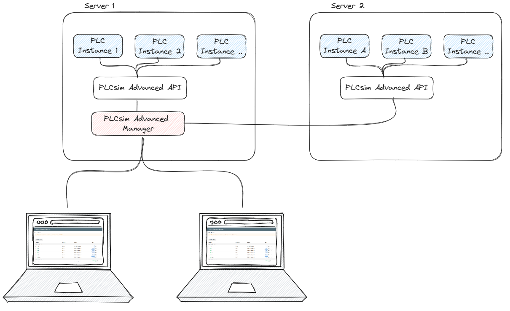
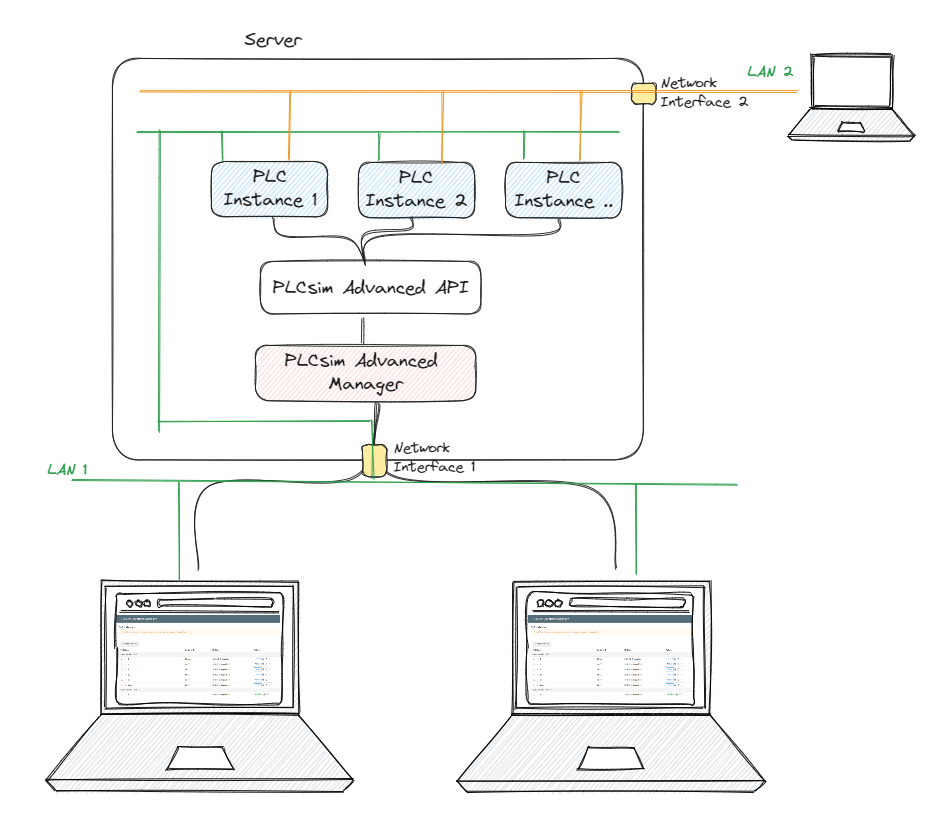

# PLCsim-Advanced-Manager

A webserver manager for Siemens Simatic PLCsim Advanced.

Goals:

- Manage your PLCSIM Advanced instances remote in a webserver. This way you don't have to log in to the target PC, but can start
  instances over the network
- Exploit the functionalities of the PLCSIM Advanced API to create a more user-friendly interface
- Read and write variables from the PLC (DB/Inputs/Outputs)
- Advanced network setting. Being able to set every interface of the instance to an interface of the host machine

## Overview

## Data monitoring and manipulation
Click the `show varibale in new tab` button on the line of the PLC.

# Quickstart

> [!WARNING]
> REQUIREMENT: PLCsim Advanced v5 or higher installed and licensed. (Trial license might give unexpected behaviour)

1. Download the latest version from the [releases](https://github.com/jasperdekeuk/PLCsim-Advanced-Manager/releases)
2. Extract the zip file
3. optional: set up the url and port in the `appsettings.json` file
4. Run the `PLCsimAdvancedManager.exe` file

> Make sure the port is not in use yet. The default port is 5000.
> 
> The `"http://*:5000"` in the appsettings.json file means that the server will listen to all incoming connections on port 5000. 
> Thus the server will be accessible from other devices in the network. This requires admin rights. You can delete this line if you only want to work locally
> 
> To reach the server from another device in the network, you have to know the IP address of the device running the server.
> You can access the server like serverIP:port

# Possible Setups

## Local setup
The most basic setup is running on the same machine as the PLCsim Advanced instance. This setup is the easiest to set up and requires no network configuration.
It is similar to how you would use PLCsim Advanced via the default UI. But with the added benefit like monitoring and manipulating variables.

### Use cases
- You want more feedback and options then with the default UI of PLCsim Advanced
- You want to monitor and manipulate variables from the PLC
- You want to use some of the feature this web app provides that are not in the default PLCsim Advanced UI
- You want to give this project a try

## Server setup
The webserver really shines when you run it on a server where PLCsim Advanced is installed. This way you can manage the PLC instances from any device in the network.

### Use cases
- You want to manage PLC instances from any device in the network
- You want to share PLC instances with other colleagues in the network
- You want to install PLCsim Advanced only on 1 machine and let multiple users use it

## Multiple servers setup
If you have multiple servers where PLCsim Advanced is installed, you can manage them all via the single webserver. This way you can manage all PLC instances from one location.
> This is technically possible, but not developed yet. Create an issue if you would need this

### Use cases
- You want to manage multiple instances of PLCsim Advanced from one location
- You want to work with more PLCsim Advanced instances than 1 server can handle (or more than the license allows) 

## Advanced network setup
PLCsim Advanced has the option to map every network interfaces of the PLC instance to a different network interfaces of the host machine. 
This way you can simulate a PLC that is connected to a different network.

### Use cases
- You want the exact setup of the PLC in the real world where the PLC is connected to multiple networks
- You want to do advanced networking setups