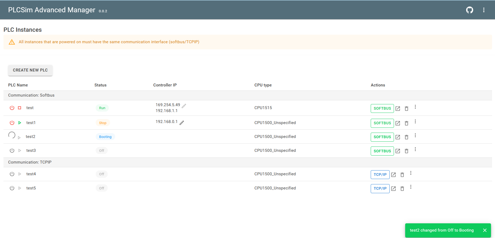

# PLCsim-Advanced-Manager

A webserver manager for Siemens Simatic PLCsim Advanced.

Goals:

- Manage your PLCSIM Advanced instances remote in a webserver. This way you don't have to login to the target PC, but can start
  instances over the network
- Exploit the functionalities of the PLCSIM Advanced API to create a more user friendly interface
- Read and write variables from the PLC (DB/Inputs/Outputs)




# Quickstart

1. Clone the repo
2. Get the DLL of PLCsim Advanced. Default location is: `Program Files (x86)\Common Files\Siemens\PLCSIMADV\API\5.0\Siemens.Simatic.Simulation.Runtime.Api.x64.dll`
3. Copy the DLL to the `Libs` folder
4. Open your terminal and go to the PLCsim_Advanced_Manager folder. (`<...>\PLCsimAdvanced_Manager\PLCsimAdvanced_Manager`)
5. Start the project
```shell
dotnet run --launch-profile http
```
6. If build is complete go to following link
> http://localhost:5030

(if build failes, make sure the port is not in use yet) 

> If you want to make it available for other devices on your network, you can run the following command
> ```shell
> dotnet run --launch-profile http --urls=http://<yourIP>:5030
> ```
> Don't forget to replace <yourIP> with your actual IP address