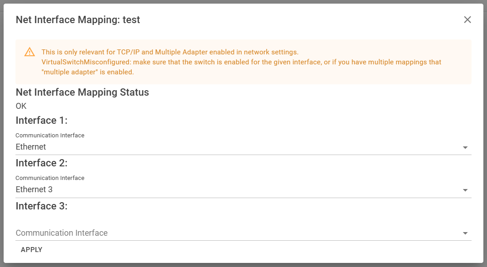

# Networking

PLCsim Advanced provides advanced networking options, but might be a bit hard to setup. The project tries to provide the common needed action in a user-friendly way.

:::warning
This page is only relevant for **TCP/IP** setup, not for Softbus.
:::

## General network settings

When clicking on the 3 dots on the right top of the page, you can access the **network settings**.

In this settings page, you can set the network mode, see the interfaces that are available and which that are binded to
PLCsim advanced.

**Network mode**
> The network mode can be set to `Single Adapter` or `Multiple Adapter`. In `Single Adapter` mode, all PLC instances
> will use the same network adapter. In `Multiple Adapter` mode, every PLC instance can use a different network adapter
> and the different interfaces of the PLC can be mapped to different network interfaces of the host machine.

**Binding Enabled**
> When binding is enabled on an interface, the PLCsim advanced virtual network interfaces are binded to that interface. 
> You can enable a binding by clicking the "set binding" button.
> Do a "reset interfaces" to clean up the bindings

## Specific instance network settings

When clicking on the 3 dots on the end row of the instance, you can access the **Net Interface Mapping** of that
instance.

Here it is possible to bind every interface of an instance to a different network interface of the host machine.
> Be sure to have the network mode set to `Multiple Adapter` in the network settings.

