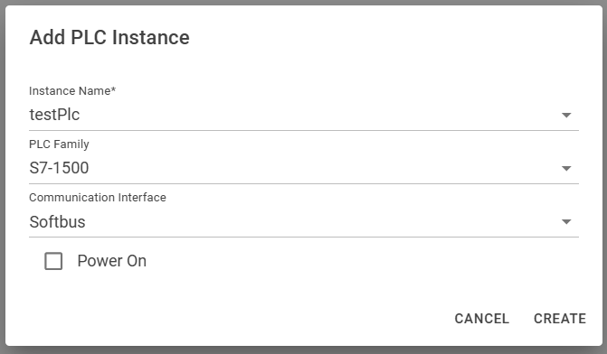

# Quick Start

## Installation

PLCsim Advanced Manager works as a standalone (exe) application, so no installation is required.  
If you don't run the exe as admin, the application will still work, but you won't be able to use some of the network
functionalities.

1. **Download** the last version of PLCsim Advanced Manager from the *
   *[Github Releases](https://github.com/jasperdekeuk/PLCsim-Advanced-Manager/releases)**.
2. *optional: set up the url and port in the appsettings.json file (this is not needed for a local setup)*
3. Run the **PLCsimAdvancedManager.exe** file to start the application. You will now be able to access the UI. On your
   localhost, you can access the UI by navigating to **http://localhost:5000**.

:::warning license
PLCsim Advanced (> v5) needs to be installed and licensed
:::
:::info default UI
You can run the application side-by-side with the default UI of PLCsim Advanced. In fact, it might even be interesting
to have both open at the same time.

The backend of PLCsim Advanced continues running as long as there is a frontend application talking to it.
Thus, when the PLCsim Advanced Manager would crash, having the default UI running on the machine will keep the PLCsim
Advanced instance up and running.
:::

## Create an instance

Now that you have the application running and are able to access the UI in your browser, you can start creating a new
instance.

Click the **"Create New PLC"** button in the top left corner. This will open a popup where you can fill in the details
of the PLC instance you want to create.

You can choose to directly power on the new instance by checking the **"Power On"** checkbox.

:::warning networking
PLCsim Advanced only supports instances with the same Communication Interface to be powered on at the same time.

It is not possible to have an instance with Softbus powered on at the same time as an instance with TCP/IP.

When an instance is powered of, you can click on e.g. the `Softbus` button to swap the Communication Interface
to `TCP/IP` or vice versa.
:::

## Restart old instances

When clicking the **"Storage"** button in the top left corner, you will see a list of all the instances that are stored
on your machine.

## Take a snapshot

:::info icons
Hovering over the icons in the action column will give you a tooltip with the action that will be performed when clicking the icon.
:::

In the actions column of the instance you can click on the **Snapshot Icon**  to create a snapshot of the software and
hardware of the PLC instance. Give it a tagname and rollback to it in a later state, when you want to go back to that
state.

## Monitoring and manipulating variables

Click the **"Show Variables"** button in the actions column of the instance to open a new tab. Here you can monitor and manipulate the variables of the PLC instance.

## Delete an instance

When you want to delete an instance, click the **"Delete"** button in the actions column of the instance.
When checking the "Cleanup Storage" checkbox, the instance will be removed from the storage as well.

